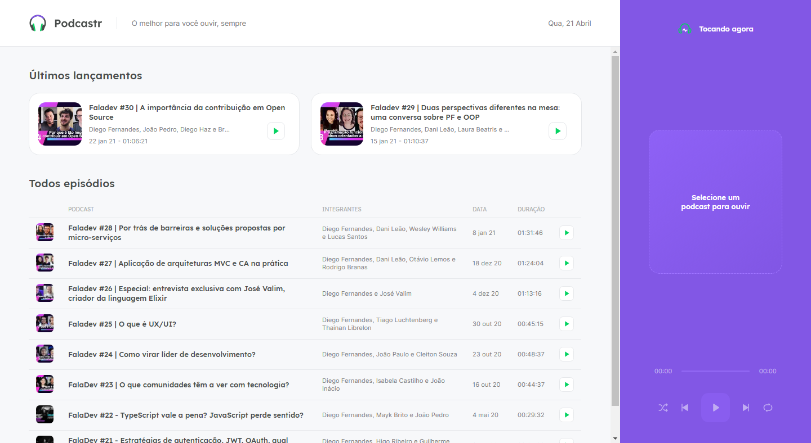

<p align="center">
  
</p>

<p align="center">
  <a href="#about">About</a>&nbsp;&nbsp;&nbsp;|&nbsp;&nbsp;&nbsp;
  <a href="#preview">Preview</a>&nbsp;&nbsp;&nbsp;|&nbsp;&nbsp;&nbsp;
  <a href="#technologies">Technologies</a>&nbsp;&nbsp;&nbsp;|&nbsp;&nbsp;&nbsp;
  <a href="#building">Building</a>&nbsp;&nbsp;&nbsp;|&nbsp;&nbsp;&nbsp;
  <a href="#layout">Layout</a>&nbsp;&nbsp;&nbsp;|&nbsp;&nbsp;&nbsp;
  <a href="#contributing">Contributing</a>&nbsp;&nbsp;&nbsp;|&nbsp;&nbsp;&nbsp;
</p>

## About
<strong>Podcastr</strong> is a platform for you to host your podcast!

This is a project developed during the **[Next Level Week](https://nextlevelweek.com/)**, presented by **[@Rocketseat](https://github.com/Rocketseat)** during April 19-25, 2021.

## Preview
<p align="center">
  
</p>

## Technologies
This project was developed using the following technologies:

- [Next.js](https://nextjs.org/)
- [React](https://reactjs.org)
- [TypeScript](https://www.typescriptlang.org/)

## Building

You'll need [Node.js](https://nodejs.org) installed on your computer in order to build this app.

```bash
git clone https://github.com/eric-souzams/nlw5-react-podcastr.git
$ cd nlw5-react-podcastr
$ yarn install
$ yarn dev
```

Runs the app in the development mode.<br/>

## Contributing

This repository is currently under development. If you want to contribute please fork the repository and get your hands dirty, and make the changes as you'd like and submit the Pull request.